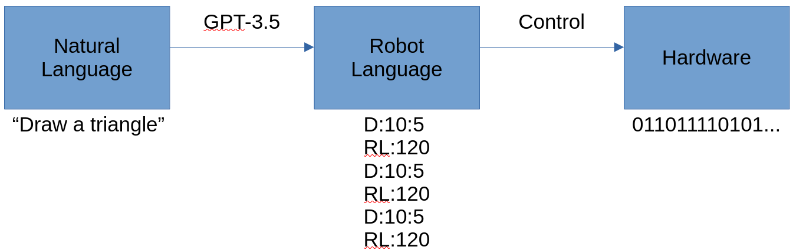
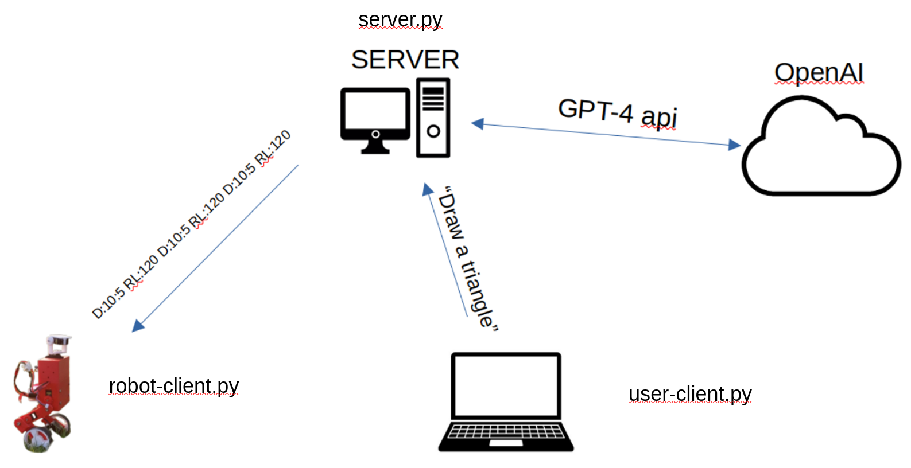
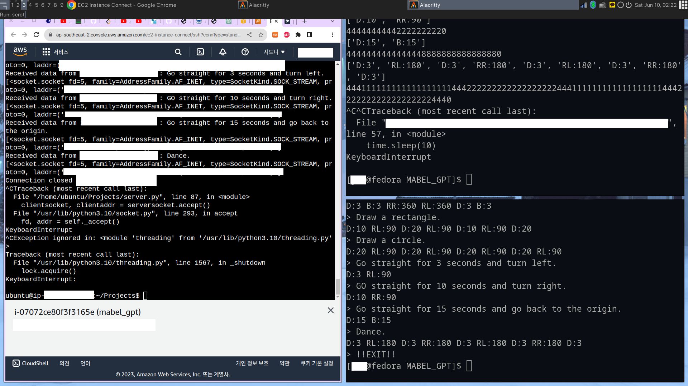

# MABEL GPT
## Introduction
To make MABEL understand human language and follow instructions.
Like these:
- PaLM-SayCan.
- Interactive Language: Talking to Robots in Real Time.

## Method

It's hard to train a new LLM to make this possible. It takes a lot of time and money. So I decided to utilize in-context learning of existing LLM, for example GPT-3.5.

Given the natural language, GPT-3.5 changes the words into another form of language which I refer to the robot language in this document. The prompt is below:

- I made a robot that follows a robot
language. I'll describe the grammar of the language. D
means going forward, B means going backward and RL
means rotating left-wise and RR means rotating right-
wise. You must add a colon followed by a number, then
it describes how much time the robot uses for the left
command. The speed of robot is predetermined. RL or RR
must be also followed by a colon and a number. The
number means how much the robot rotates in degrees.
I'll give you some examples. D:13 D:10 RR:5 RL:60 D:1
The code above means for a robot to go forward for 13
seconds then go forward for 10 seconds then rotate
right 5 degrees then rotate left 60 degrees then go
forward for 1 second. Please translate "*Draw a triangle*" in the robot language. IMPORTANT!!! Do not
add any comment! Do not say "To draw something, you
can use the following commands". Do not describe nor
explain what you provided.

The part "*Draw a triangle*" will be replaced with a desired instruction at running time.

The robot language will be parsed and sended to the arduino through serial communication.

## Implementation

The natural language is typed on the laptop and sended to server. Server will replace "*Draw a triangle*" with the user input. Then server sends the prompt to the OpenAI server through GPT-3.5 API or GPT-4 API. After receiving a response from the OpenAI server, which should be the robot language, the response is sended to the MABEL. Finally, the MABEL parses the robot language into low level signals and directly control the motors.

## Progress

- [x] All of the codes regarding LLM are completed.

- [ ] Tuning PID control gain is incompleted.